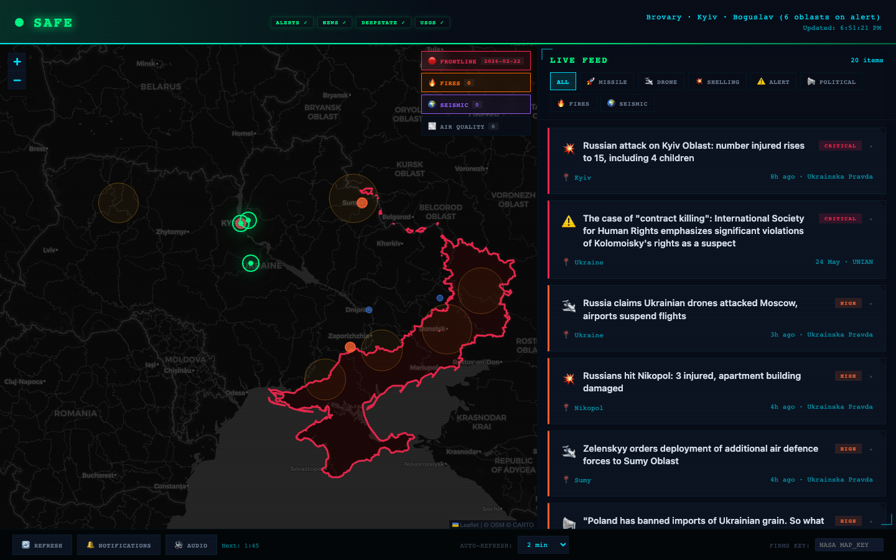

<div align="center">

# ВАРТА /// VARTA

### Real-Time Tactical Surveillance for Ukraine

[](LICENSE)
[](#quick-start)
[](#quick-start)
[](#data-sources)

<br>



<br>

*A military command center in your browser — monitoring Ukraine's airspace, frontlines, and threats in real time.*

<br>

[**Live Demo**](https://clmrie.github.io/varta) · [Report Bug](https://github.com/clmrie/varta/issues) · [Request Feature](https://github.com/clmrie/varta/issues)

</div>

---

## What is VARTA?

**VARTA** (*Варта* — Ukrainian for "The Guard") is a live dashboard that tracks the war in Ukraine from **6 independent sources** — and displays everything on a single interactive map.

Air raid sirens. Russian frontline positions. Fires detected from space. Earthquake sensors. Air pollution. Breaking news. All updating automatically, all in one place, all free to use.

> **Why?** Because civilians deserve the same situational awareness that used to be reserved for operations rooms.

---

## Features

<table>
<tr>
<td width="50%">

### 🛰️ Fires Detected from Space
Uses NASA satellite imagery to spot active fires and thermal anomalies across Ukraine — including infrastructure hits and explosions visible from orbit.

### 📡 Live Air Raid Alerts
Tracks active sirens across all 26 Ukrainian oblasts in real time. Color-coded by severity. Precise down to individual cities.

### 🔴 Russian Frontline Positions
Shows exactly where Russian-occupied territory is, updated daily from [DeepStateMap](https://github.com/cyterat/deepstate-map-data). Bright red borders mark the frontline.

</td>
<td width="50%">

### 🌍 Earthquake & Explosion Detection
Monitors seismic activity across Ukraine using US Geological Survey sensors — helping distinguish natural earthquakes from military explosions.

### 🌫️ Air Quality After Strikes
Tracks air pollution levels (PM2.5 and PM10) across 6 major cities. Critical for understanding the environmental impact of attacks.

### 📰 Live Breaking News
Automatically pulls English-language news from major Ukrainian outlets, sorted by urgency. Click any headline to read the full article.

</td>
</tr>
</table>

### Plus...

- **🔗 Smart Alert Correlation** — When satellites detect fire in a region that also has active sirens and seismic activity, VARTA automatically flags it as a confirmed strike
- **🔔 Desktop Notifications** — Get notified instantly when something critical happens
- **🔊 Audio Warnings** — Audible alert tones for high-severity events
- **🗺️ City-Level Precision** — 48 Ukrainian cities mapped with exact coordinates
- **💾 Remembers Your Settings** — Your preferences are saved between visits
- **📱 Works on Any Screen** — Desktop, tablet, or phone

---

## Data Sources

| What | Source | Updates |
|------|--------|---------|
| **Air Raid Alerts** | [alerts.in.ua](https://alerts.in.ua) | Real-time |
| **News** | [Ukrainska Pravda](https://www.pravda.com.ua/eng/) + [UNIAN](https://www.unian.net/) | Every refresh |
| **Satellite Fires** | [NASA FIRMS](https://firms.modaps.eosdis.nasa.gov/) | Every 3–6 hours |
| **Seismic Activity** | [USGS](https://earthquake.usgs.gov/) | Real-time |
| **Air Quality** | [Open-Meteo](https://open-meteo.com/) | Every 15 minutes |
| **Frontline** | [DeepStateMap](https://github.com/cyterat/deepstate-map-data) | Daily |

All data comes from **free, publicly available sources**. No accounts or setup needed.

---

## Quick Start

```bash
git clone https://github.com/clmrie/varta.git
open varta/index.html
```

That's it. Open the file in any browser and you're live.

Want to share it? Deploy it on **GitHub Pages** for free:

1. Fork this repo
2. Go to **Settings → Pages**
3. Set source to **Deploy from branch → `main` → `/ (root)`**
4. Your dashboard is now live at `https://yourusername.github.io/varta`

---

## Disclaimer

> VARTA aggregates publicly available data for **informational purposes only**. It is not a military system. Data accuracy depends on upstream providers (alerts.in.ua, NASA, USGS, DeepStateMap). Frontline positions are approximate and updated daily. **Do not make safety-critical decisions based solely on this dashboard.** Always follow official instructions from Ukrainian authorities.

---

## License

[MIT](LICENSE) — Free to use, modify, and share.

---

<div align="center">

🇺🇦

**Слава Україні! / Glory to Ukraine!**

*Built with open data and open hearts.*

<sub>VARTA (Варта) — "The Guard" — Standing watch so you don't have to.</sub>

</div>
